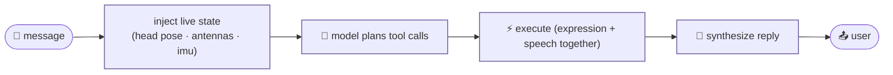
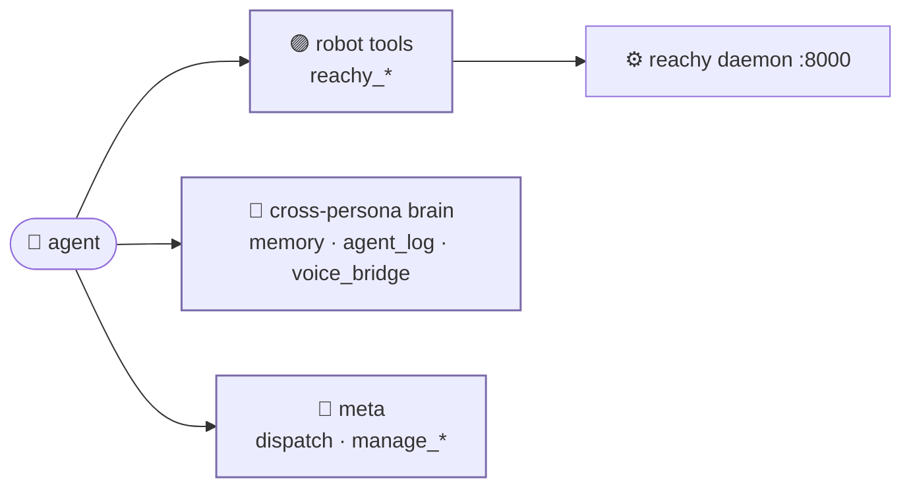

# architecture

<span class="read-badge">⏱ 90s</span>

How `tiny` fits together — and how it differs from its siblings.

## physical layout

```
Reachy Mini
├─ your laptop (Lite)  OR  onboard CM4 (Wireless)   ← runs tiny + the daemon
│    tiny agents → .venv/bin/python agent.py   (or docker compose)
│      Strands loop · TINY_ALL_TOOLS (14) · voice/telegram/thinker
│    reachy-mini daemon (FastAPI) on :8000     ← owns the hardware
▼
└─ Reachy Mini hardware
     6-DOF head (Stewart platform) · rotating body · 2 antennas
     camera · microphone · speaker · IMU
```

**Key difference from neon:** Reachy has **no DDS, no CycloneDDS, no
librealsense**. Control is plain HTTP/WS to the daemon on `:8000`. The Docker
image is *light* — no motor-bus build, no realsense compile.

## the agent loop



Every turn injects the shared cross-persona log + live pose into the prompt, so
the model wakes up already knowing what the other personas did and where the
head is.

## the tool layers



- **robot tools** — 14 `reachy_*` wrappers, all through a cached `get_mini()` client
- **cross-persona brain** — copied verbatim from neon (see [the brain](brain.md))
- **meta** — `dispatch` (spawn sub-agents), `manage_messages`, `manage_tools`

## single source of truth

All persona / tool / prompt wiring lives in `tiny.py`:

```python
build_agent(persona)     # generic factory
build_shell_agent()      # REPL
build_voice_agent()      # bidi voice
# thinker + telegram personas built from the same list
```

One tool list, four personas. Change a tool once, every face gets it.
