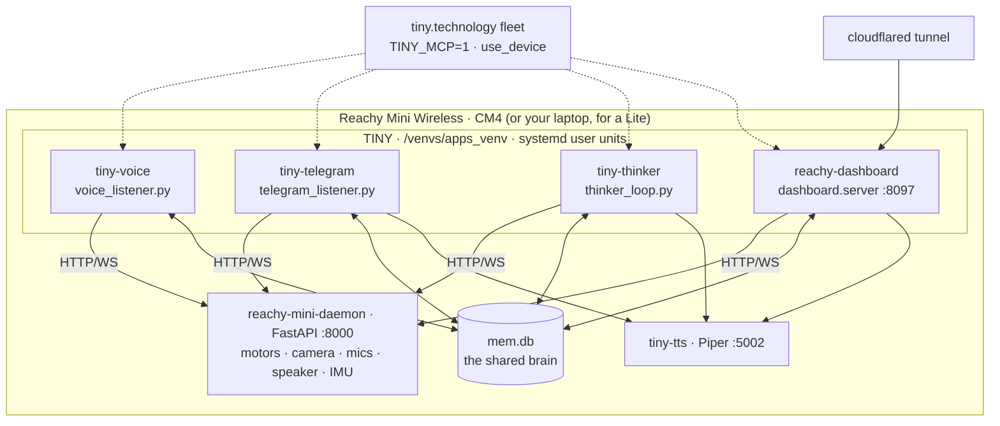
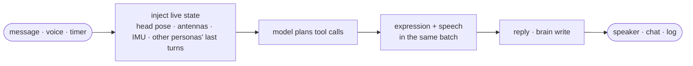

# Architecture

!!! abstract "In 10 seconds"
    - **Pollen's daemon** (`reachy-mini-daemon`, FastAPI, `:8000`) is the only process that touches motors, camera, mics and speaker. TINY is a pure HTTP/WS client of it — no DDS, no realsense, no motor bus.
    - **One tool list** (`tools/__init__.py`: 19 `reachy_*` robot tools + 8 cross-persona tools) and **one factory** (`tiny.py` `build_agent(persona)`) serve five faces: shell, voice, telegram, thinker, dashboard Ask.
    - **One brain**: a SQLite file every persona reads at the top of each turn and writes at the end ([the brain](brain.md)).
    - Beside them on the CM4: the cockpit (`dashboard.server`, `:8097`), a named Cloudflare tunnel, and the optional tiny.technology fleet bridge (`TINY_MCP=1`).

## The body

<figure class="anatomy" data-anatomy="body" data-base="../../" markdown>
<figcaption>The dashboard's MuJoCo twin (<code>model/twin.xml</code>, 18 bodies, 41 meshes) split by body group. Each hotspot opens the tool page that drives that part.</figcaption>
</figure>

Reachy Mini has no arms and no legs. Everything TINY *is* comes out of a 6-DOF head on a Stewart platform, a rotating base, two antenna
servos, one wide camera, a four-mic XMOS array and a speaker — plus an IMU the daemon exposes with the pose.

## Physical layout



The Lite variant is the same picture with the daemon and TINY on your laptop over USB; the simulator (`REACHY_USE_SIM=1`) swaps the
daemon for a headless MuJoCo one. Connection mode and host are read once in `tools/_reachy_common.py` (`REACHY_CONNECTION_MODE`,
`REACHY_HOST`, `REACHY_PORT`) and every tool goes through its cached `get_mini()` client — which rebuilds itself when the daemon restarts
underneath it ([systemd → lessons](../start/systemd.md#the-units-as-installed)).

## One turn



Every turn starts by injecting the shared log and the live pose into the prompt, so a persona wakes up already knowing what the others did
and where the head is. The playbook in `prompts/base.md` asks for gestures **in the same turn as speech**, never before or after — that is
the whole point of the [expression showcase](../showcase/expression.md).

## The tool layers

<div class="cards cards--3" markdown>

| layer | modules | what |
|---|---|---|
| **Robot tools** | `reachy_motion` · `reachy_expression` · `reachy_state` · `reachy_camera` · `head_tracking` · `turn_to_sound` · `reachy_audio` | 19 `reachy_*` wrappers, every angle clamped before it reaches the daemon — [safety envelope](safety.md) |
| **Cross-persona brain** | `memory` · `voice_bridge` · `dispatch` · `telegram` · `vision` · `prompts` · `manage_*` | 8 tools shared by the faces: remember, hand a task over, speak through the voice persona — [the brain](brain.md) |
| **Fleet** | `tiny_mcp` | `use_device` and friends, mounted only when `TINY_MCP=1` and the persona is in `TINY_MCP_PERSONAS`, never on a turn that arrived from another device — [fleet](../MCP.md) |

</div>

The exact roster, with signatures, is generated from the code at every build: [tools reference](../reference/tools/index.md).

## One source of truth

All persona, tool and prompt wiring lives in `tiny.py`:

```python
build_tools()            # text personas: everything above (+ use_github/use_spotify when importable)
build_voice_tools()      # voice + dashboard Ask: the latency-slim list
build_agent(persona)     # shell · telegram · thinker · dashboard — one factory, per-persona prompt
build_shell_agent()      # the REPL you get from `make run`
build_voice_agent()      # the bidi voice persona (openai · nova_sonic · gemini)
```

Change a tool once and every face gets it. Change a prompt at runtime with the [`prompts`](../reference/tools/prompts.md) tool and the
override is appended to that persona's system prompt (`FULL:` replaces it).

## What is *not* here

- No ROS, no DDS, no CycloneDDS, no librealsense build — Reachy control is plain HTTP/WS, so the Docker image is small and the CM4 runs bare-metal.
- No process of ours talks to hardware. If the daemon is down, every tool returns an error string the model can read aloud, and nothing else breaks.
- No secrets in the tree: `.env`, `~/.reachy-dashboard.env`, `~/.tiny-mcp.env` — see [env vars](../reference/env.md).
