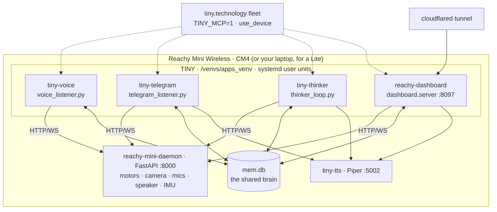

# Architecture

!!! abstract "In 10 seconds"
    - **Pollen's daemon** (`:8000`) alone touches motors, camera, mics, speaker. TINY is an HTTP/WS client.
    - **One tool list** (19 `reachy_*` + 8 shared) and **one factory** (`build_agent(persona)`) serve five faces.
    - **One brain**: a SQLite file every persona reads first and writes last ([the brain](brain.md)).

## The body

<figure class="anatomy" data-anatomy="body" data-base="../../" markdown>
<figcaption>The MuJoCo twin. Each hotspot opens the tool that drives that part.</figcaption>
</figure>

No arms, no legs: a 6-DOF head, a rotating base, two antennas, a camera, four mics, a speaker.

## Physical layout



A Lite is the same picture on a laptop; `REACHY_USE_SIM=1` swaps in MuJoCo. Every tool shares one cached `get_mini()` client that rebuilds itself after a daemon restart.

!!! danger "Never construct a second `ReachyMini()`"
    Two clients fight the daemon. Always `get_mini()`.

```
# the SDK surface TINY relies on
goto_target · set_target · wake_up · goto_sleep · get_current_head_pose · get_current_joint_positions
enable_motors · disable_motors · enable_gravity_compensation · look_at_image · play_move · enable_wobbling
media.get_frame · media.play_sound · imu · RecordedMoves.list_moves()
```

## One turn


A persona wakes knowing what the others did and where its head is. Gestures go **in the same turn as speech**.

## The tool layers

<div class="cards cards--3" markdown>

| layer | modules | what |
|---|---|---|
| **Robot** | `reachy_motion` · `reachy_expression` · `reachy_state` · `reachy_camera` · `head_tracking` · `turn_to_sound` · `reachy_audio` | 19 wrappers, every angle clamped — [safety](safety.md) |
| **Brain** | `memory` · `voice_bridge` · `dispatch` · `telegram` · `vision` · `prompts` · `manage_*` | 8 shared tools — [the brain](brain.md) |
| **Fleet** | `tiny_mcp` | `use_device` & co, `TINY_MCP=1` only — [fleet](../MCP.md) |

</div>

## `tiny.py`

```python
build_tools()            # text personas: everything above (+ use_github/use_spotify when importable)
build_voice_tools()      # voice + dashboard Ask: the latency-slim list
build_agent(persona)     # shell · telegram · thinker · dashboard — one factory, per-persona prompt
build_shell_agent()      # the REPL you get from `make run`
build_voice_agent()      # the bidi voice persona (openai · nova_sonic · gemini)
```

Change a tool once, every face gets it. Daemon down → every tool returns an error string the model can read aloud.
