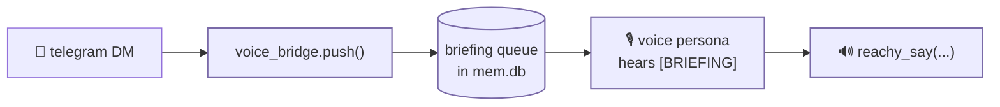

# the cross-persona brain

<span class="read-badge">⏱ 60s</span>

The thing that makes TINY feel like *one being* across four faces is a shared
SQLite brain at `.memory/mem.db`. This whole subsystem is **copied verbatim
from neon** — don't reinvent it; it just works.

## what's in the db

| table | tool | purpose |
|---|---|---|
| `kv` | `memory` | key/value store (e.g. `voice.muted`) |
| `log` | `memory` | freeform notes / journal |
| `agent_log` | `agent_log` | unified cross-persona reasoning log |
| `voice_bridge` | `voice_bridge` | briefing queue → voice persona |
| `tg_history` | `telegram` | per-chat message history |
| `prompts` | `prompts` | per-persona prompt overrides |

## the unified reasoning log

Every persona records what it does with `agent_log.record(...)`, and every
persona injects the recent log into its prompt with
`agent_log.format_for_prompt(limit=...)`. The result: when telegram answers a
DM, the voice persona sees it on its next turn.

```python
from tools.agent_log import record, format_for_prompt
record(persona="telegram", text="user asked about the weather")
# ...later, in the voice persona's prompt:
format_for_prompt(limit=30)   # → the last 30 cross-persona turns
```

## the voice bridge

Async inbound messages (like a Telegram DM) get pushed to the voice persona so
it can *speak* them:



## inspect it

```bash
make log-show     # last 30 cross-persona turns
make mute         # writes voice.muted=true to kv
make voice-status # reads it back
```

## why verbatim

neon, scout, and tiny all share this exact code. A fix to the brain in one repo
is a fix everywhere. The **only** thing that changes between robots is the tool
layer that touches hardware.
