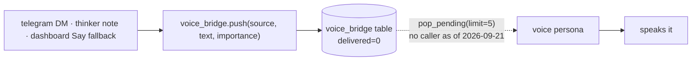

# The cross-persona brain

!!! abstract "In 10 seconds"
    - `.memory/mem.db` (`tools/memory.py:15`) is shared by all five faces — one file, nine tables, created on first use.
    - `agent_log.record(...)` at the end of a turn, `format_for_prompt(limit)` at the top of the next — that is the whole trick.
    - `voice_bridge.push()` queues a briefing for the voice persona — but **nothing drains the queue today** (`pop_pending` has no caller; `voice_listener.py` feeds the model only the mic).
    - Verbatim from neon; only the hardware tool layer differs between robots.

## What is in the db

<div class="filterable" data-id="table" data-placeholder="kv, prompts, dispatch…" markdown>

| table | created in | purpose |
|---|---|---|
| `kv` | `tools/memory.py:22` | key/value — `voice.muted` is what `make mute` writes |
| `log` | `tools/memory.py:27` | freeform journal |
| `agent_log` | `tools/agent_log.py:31` | the cross-persona reasoning log — `persona, role, text, meta_json, ts` |
| `voice_bridge` | `tools/voice_bridge.py:27` | briefing queue → voice persona |
| `tg_history` | `tools/telegram.py:45` | per-chat Telegram history |
| `prompts` · `prompt_history` | `tools/prompts.py:32,38` | per-persona overrides + every previous version |
| `dispatches` · `dispatch_schedules` | `tools/dispatch.py:61,78` | sub-agent hand-offs |

</div>

## The unified reasoning log

When telegram answers a DM, the voice persona sees it on its next turn:

```python
from tools.agent_log import record, format_for_prompt
record(persona="telegram", text="user asked about the weather")
# ...later, in the voice persona's prompt:
format_for_prompt(limit=30)   # → the last 30 cross-persona turns
```

## The voice bridge



!!! warning "Honest state of the bridge (2026-09-21)"
    `voice_say` answers *"Voice agent will speak this within ~2s"* (`voice_bridge.py:161`), but nothing calls `pop_pending()`: `voice_listener.py` runs `agent.run(inputs=[audio_io.input()])` — the microphone is its only input — so briefings accumulate until `prune()`. The dashboard knows: `say()` uses Piper first and logs *"say QUEUED (local TTS down)"* on fallback (`robot.py:415-432`). Want to be heard? Call `reachy_say`, not `voice_say`. Wiring a briefing input into the voice session is the open item.

## Inspect it

```bash
make log-show     # last 30 cross-persona turns
make mute         # writes voice.muted=true to kv
make voice-status # reads it back
```

## Why verbatim

neon, scout and tiny share this exact code — a fix in one repo is a fix everywhere. Only the hardware tool layer differs.
