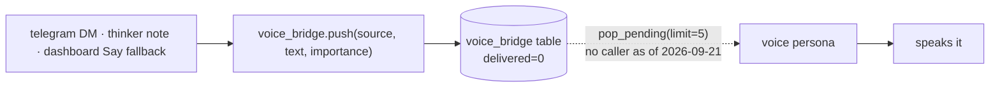

# The cross-persona brain

!!! abstract "In 10 seconds"
    - `.memory/mem.db` is shared by all five faces — one file, nine tables.
    - `agent_log.record(...)` at the end of a turn, `format_for_prompt()` at the top of the next — the whole trick.
    - `voice_bridge.push()` queues a briefing for the voice persona — but **nothing drains the queue today**.
    - Verbatim from neon and scout — a fix in one repo is a fix everywhere.

## What is in the db

<div class="filterable" data-id="table" data-placeholder="kv, prompts, dispatch…" markdown>

| table | created in | purpose |
|---|---|---|
| `kv` | `tools/memory.py:22` | key/value — `voice.muted` lives here |
| `log` | `tools/memory.py:27` | freeform journal |
| `agent_log` | `tools/agent_log.py:31` | the cross-persona log — `persona, role, text, meta_json, ts` |
| `voice_bridge` | `tools/voice_bridge.py:27` | briefing queue → voice persona |
| `tg_history` | `tools/telegram.py:45` | per-chat Telegram history |
| `prompts` · `prompt_history` | `tools/prompts.py:32,38` | per-persona overrides + history |
| `dispatches` · `dispatch_schedules` | `tools/dispatch.py:61,78` | sub-agent hand-offs |

</div>

## The unified reasoning log

When telegram answers a DM, voice sees it on its next turn:

```python
from tools.agent_log import record, format_for_prompt
record(persona="telegram", text="user asked about the weather")
# ...later, in the voice persona's prompt:
format_for_prompt(limit=30)   # → the last 30 cross-persona turns
```

## The voice bridge



!!! warning "Honest state of the bridge (2026-09-21)"
    `voice_say` answers *"Voice agent will speak this within ~2s"*, but nothing calls `pop_pending()`: `voice_listener.py` feeds the model only the microphone, so briefings accumulate until `prune()`. Want to be heard? Call `reachy_say`. Wiring a briefing input into the voice session is the open item.

## Inspect it

```bash
make log-show     # last 30 cross-persona turns
make mute         # writes voice.muted=true to kv
make voice-status # reads it back
```
