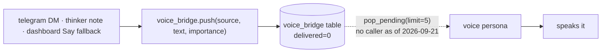

# The cross-persona brain

!!! abstract "In 10 seconds"
    - `.memory/mem.db` (repo root; `tools/memory.py:15`) is shared by shell, voice, telegram, thinker and the dashboard — one file, nine tables, all `CREATE TABLE IF NOT EXISTS` on first use.
    - `agent_log.record(...)` at the end of a turn, `agent_log.format_for_prompt(limit)` at the top of the next — that is the whole trick.
    - `voice_bridge.push()` queues a briefing for the voice persona — but **nothing drains the queue today** (`pop_pending` has no caller outside `tools/`; `voice_listener.py` feeds the model only the mic). The dashboard speaks through Piper directly and treats the bridge as a last resort (`dashboard/robot.py:419`).
    - Copied verbatim from neon; the hardware tool layer is the only thing that differs between robots.

## What is in the db

<div class="filterable" data-id="table" data-placeholder="kv, prompts, dispatch…" markdown>

| table | created in | purpose |
|---|---|---|
| `kv` | `tools/memory.py:22` | key/value store (e.g. `voice.muted`, what `make mute` writes) |
| `log` | `tools/memory.py:27` | freeform notes / journal |
| `agent_log` | `tools/agent_log.py:31` (+ `dashboard/robot.py:512`) | the unified cross-persona reasoning log — `id, persona, role, text, meta_json, ts` |
| `voice_bridge` | `tools/voice_bridge.py:27` (+ `dashboard/robot.py:551`) | briefing queue → voice persona |
| `tg_history` | `tools/telegram.py:45` | per-chat Telegram history |
| `prompts` · `prompt_history` | `tools/prompts.py:32,38` | per-persona prompt overrides and every previous version |
| `dispatches` · `dispatch_schedules` | `tools/dispatch.py:61,78` | sub-agent hand-offs and their schedules |

</div>

## The unified reasoning log

Every persona records what it does with `agent_log.record(...)`, and every
persona injects the recent log into its prompt with
`agent_log.format_for_prompt(limit=...)`. The result: when telegram answers a
DM, the voice persona sees it on its next turn.

```python
from tools.agent_log import record, format_for_prompt
record(persona="telegram", text="user asked about the weather")
# ...later, in the voice persona's prompt:
format_for_prompt(limit=30)   # → the last 30 cross-persona turns
```

## The voice bridge

Async inbound messages (a Telegram DM, a thinker note, a dashboard *Say* when local TTS is down) are pushed into the `voice_bridge` table so
the voice persona can *speak* them:



!!! warning "Honest state of the bridge (2026-09-21)"
    `voice_say` answers *"Voice agent will speak this within ~2s"* (`tools/voice_bridge.py:161`), but no process in this repo calls
    `pop_pending()`: `voice_listener.py` runs `agent.run(inputs=[audio_io.input()])` with the microphone as its only input, so queued
    briefings accumulate undelivered until `prune()` removes them. The dashboard knows — its `say()` uses local Piper first and only falls
    back to the bridge when TTS is down, logging *"say QUEUED (local TTS down)"* (`dashboard/robot.py:415-432`). Text personas that want to
    be heard should call `reachy_say` (Piper → daemon speaker) rather than `voice_say`. Wiring a briefing input into the voice session is
    the open item.

## Inspect it

```bash
make log-show     # last 30 cross-persona turns
make mute         # writes voice.muted=true to kv
make voice-status # reads it back
```

## Why verbatim

neon, scout, and tiny all share this exact code. A fix to the brain in one repo
is a fix everywhere. The **only** thing that changes between robots is the tool
layer that touches hardware.
