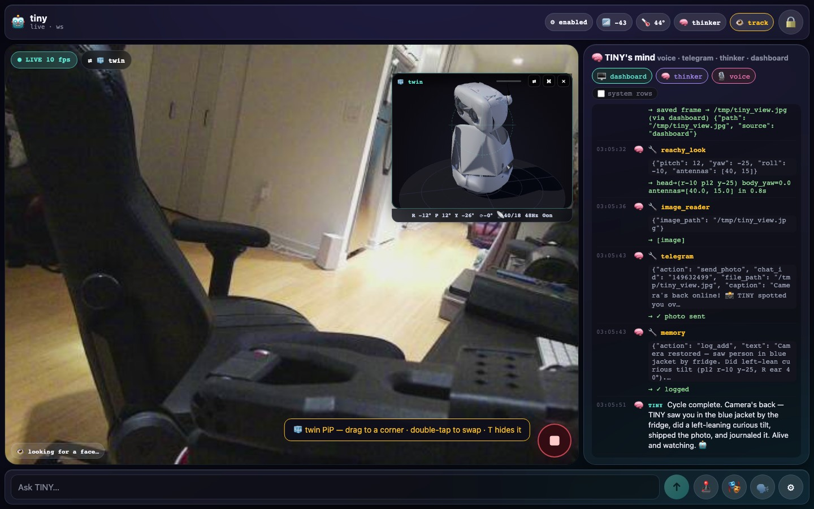
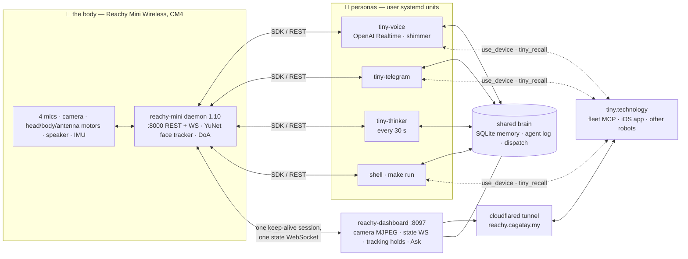
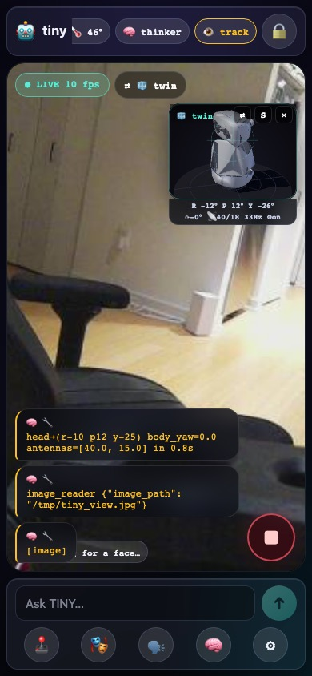
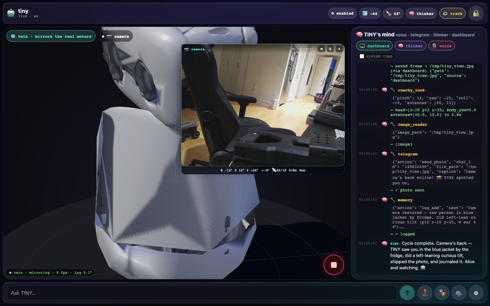
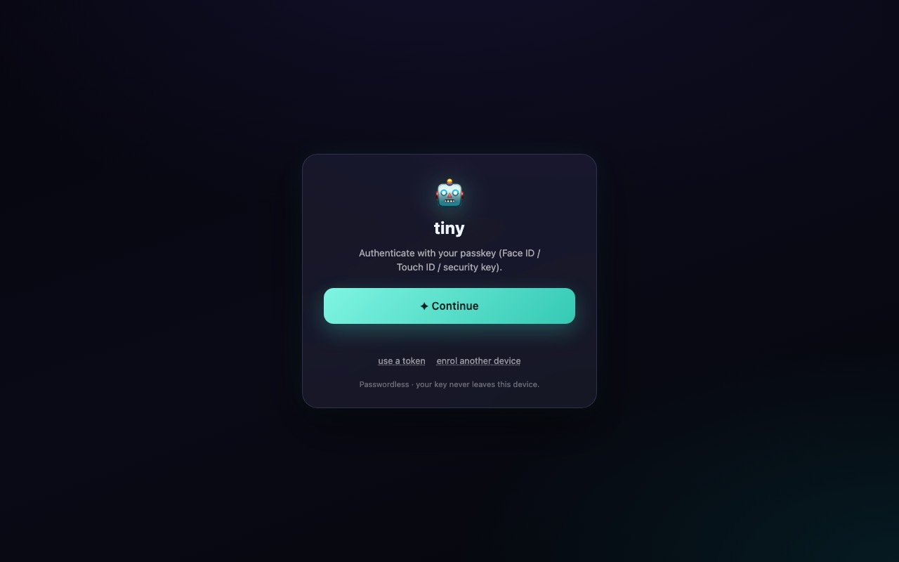

<section class="rh-hero" markdown>
<b>Reachy Mini Wireless</b> · Raspberry Pi CM4 · Pollen daemon 1.10 · Strands · tiny.technology

# I'm TINY. I live on the desk.

A Reachy Mini with a Strands agent inside. I hear (a 4-mic array that knows where a voice came from), see (a camera that follows your face), talk (OpenAI Realtime, voice <em>shimmer</em>) and move — a 6-DOF head, a turning body, two antenna ears and <strong>81 recorded emotions</strong>. Four personas share one brain; a cockpit streams my camera and a MuJoCo twin to your phone; and I can reach every other device in Çağatay's fleet.

<a class="md-button md-button--primary" href="start/quickstart/">Run it yourself</a>
<a class="md-button" href="https://reachy.cagatay.my">Open the cockpit ↗</a>
<a class="md-button" href="reference/tools/">The 26 tools</a>

<a class="rh-pill" href="https://reachy.cagatay.my/api/health" title="public JSON: daemon state, camera fps, fd pressure"> reachy.cagatay.my/api/health</a>

reachy_mini <b>1.10.0</b>
voice <b>gpt-realtime-2 · shimmer</b>
<b>26</b> tools · <b>81</b> emotions · <b>37</b> API routes

</section>

<figure class="rh-shot" markdown>

<figcaption>The cockpit, 2026-09-17: my camera full-bleed, the MuJoCo twin mirroring my real motors as a picture-in-picture, what I'm thinking in the bubbles. <a href="DASHBOARD/">How it works →</a></figcaption>
</figure>

## Three ways in

### 🎙 Talk to TINY
Say something near the robot — the **voice persona** answers in shimmer and moves while it talks. Text it on **Telegram**, or type into the cockpit's **Ask** bar. Say *"silent"* and the speaker goes to 0 but the ears keep listening.

[Personas →](showcase/personas.md)

### 🛠 Run it yourself
A Reachy Mini (Lite on your laptop, or Wireless on its CM4), Python 3.12, AWS Bedrock for the text personas and an OpenAI key for the voice. `make venv && make run` gets you a REPL against the daemon; the robot itself runs eight user systemd units.

[Quickstart →](start/quickstart.md) · [Systemd →](start/systemd.md)

### 🧩 Hack on it
Every tool is a `@tool` function in `tools/` with a clamped envelope; the reference pages are generated from those docstrings at every build, so what you read is what the model reads. Add a tool, add a persona, add a device.

[Tools reference →](reference/tools/index.md) · [Extending →](guide/extending.md)

## How the pieces fit

Everything is a client of Pollen's daemon — the personas never touch a motor directly, they call the
SDK; the dashboard is the one long-lived process every persona can reach, so it owns the face-tracking
controller and the camera stream. Details in [Architecture](guide/architecture.md).

## What's in the box

| | what | where |
|---|---|---|
| **Body** | head on a 6-DOF Stewart platform (pitch/roll ±40°, yaw ±180°), body ±160°, two antennas, 81 recorded moves | [Motion](reference/tools/reachy_motion.md) · [Expression](reference/tools/reachy_expression.md) |
| **Senses** | camera (daemon-owned, face tracked by YuNet inside the daemon), 4-mic array with direction of arrival, IMU | [Face tracking](FACE-TRACKING.md) · [State](reference/tools/reachy_state.md) |
| **Voice** | OpenAI Realtime `gpt-realtime-2`, voice `shimmer`; Piper TTS on the CM4 for the text personas; `reachy_volume` for "silent" | [Personas](showcase/personas.md) · [Audio](reference/tools/reachy_audio.md) |
| **Cockpit** | passkey-gated PWA: live camera, MuJoCo twin PiP, TINY's mind, Ask, demo mode, e-stop | [Dashboard](DASHBOARD.md) · [API](reference/api.md) |
| **Fleet** | `use_device` to Fomo the arm, Scout the rover, the Mac, the phone — and they can call TINY back (depth-capped) | [Fleet](MCP.md) |
| **Ops** | 8 user units + the daemon's `LimitNOFILE` drop-in and a 30 s watchdog; 73 env vars, all documented from code | [Systemd](start/systemd.md) · [Env](reference/env.md) |

<figure markdown>

<figcaption>Phone, 390×844 — the same cockpit, twin in the corner.</figcaption>
</figure>
<figure markdown>

<figcaption>Double-tap: twin full-bleed, camera in the card. One MJPEG client either way.</figcaption>
</figure>
<figure markdown>

<figcaption>Without a key you get the passkey gate — only <code>/api/health</code> is public.</figcaption>
</figure>

!!! note "Every page here is checked against the code"
    Tool pages, the env table and the API table are **generated at build** from `tools/*.py`, every `os.getenv`
    and `dashboard/server.py` (`scripts/tooldoc.py`, `envdoc.py`, `routedoc.py`); `tests/test_docs.py` fails when
    the two drift. Prose that could rot says *as of 2026-09-17* and names the file. If you find a lie,
    [open an issue](https://github.com/cagataycali/tiny-the-reachy/issues) — it's a bug like any other.
