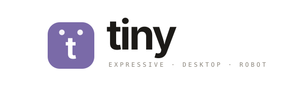
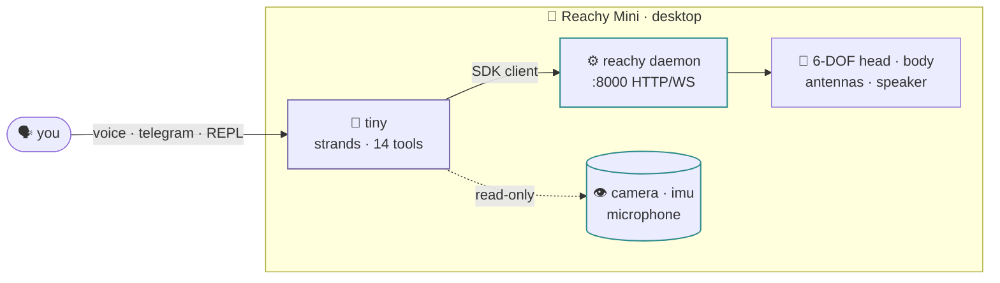

---
hide:
  - navigation
  - toc
---

a strands agent on the reachy mini · on the desk

[:material-rocket-launch: 3-minute tour](start/quickstart.md){ .md-button .md-button--primary }
[:material-github: GitHub](https://github.com/cagataycali/tiny-the-reachy){ .md-button }

 <strong>&nbsp;live on Reachy</strong>
<strong>14</strong> robot tools
<strong>4</strong> personas
<strong>6-DOF</strong> head
<strong>2</strong> antennas

tiny&nbsp;&gt; say hi and show me you're happy
  → reachy_express('happy')     rc=0 · antennas wiggle
  → reachy_say('hey there!')    rc=0 · head wobble
tiny&nbsp;&gt; Hey! 👋 

---

## the whole thing in 3 minutes

1
**What it is.** A [Strands](https://github.com/strands-agents) agent that drives a
**Reachy Mini** (Pollen Robotics). It's a pure client of the Reachy **daemon**
(`:8000`), turning every SDK call into a typed, clamped tool. Runs on your
laptop (Lite) or the onboard CM4 (Wireless).

2
**How you talk to it.** One agent, four faces — REPL, voice, Telegram, thinker.
Say `look at me`, `wiggle your antennas`, `what do you see?`, `spin around`.
It plans, fires expressions *while* speaking, and replies.

3
**Why it's expressive.** No arms, no legs — personality lives in a 6-DOF head,
a rotating body, two antenna "ears", and a recorded-emotion library. Every
answer moves. Small moves look best; the SDK clamps the envelope.

[Start the tour →](start/quickstart.md){ .md-button .md-button--primary }

---

-   :material-rocket-launch:{ .lg } **Quickstart**

    ---

    Clone, set your keys, `make run`. First wobble in 60 seconds.

    [→ quickstart](start/quickstart.md)

-   :material-hand-wave:{ .lg } **Expression**

    ---

    How tiny turns emotion into head + antenna + body motion.

    [→ expression](showcase/expression.md)

-   :material-toolbox:{ .lg } **Tool catalog**

    ---

    All 14 robot tools + the shared cross-persona brain.

    [→ catalog](tools/catalog.md)

-   :material-family-tree:{ .lg } **The family**

    ---

    neon (G1) · scout (rover) · tiny (Reachy). One brain, three bodies.

    [→ family](reference/family.md)

