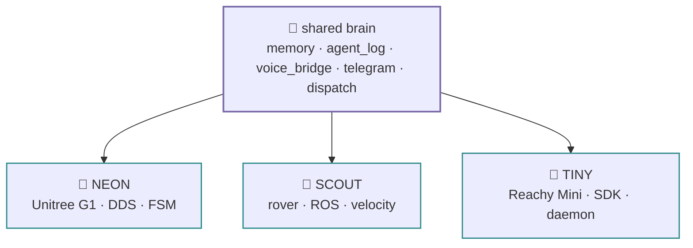

# The family — one brain, three bodies

!!! abstract "In 10 seconds"
    - Same four personas, same SQLite brain, same deploy shape, same agent factory — `memory · agent_log · voice_bridge · telegram · dispatch` are byte-identical across repos.
    - Only the hardware layer differs: NEON gates arms and legs behind an FSM and a mutex; SCOUT sends ROS velocities; TINY talks plain HTTP/WS to a daemon and has no danger class.

| robot | body | control layer | mirrors |
|---|---|---|---|
| **NEON** | Unitree G1 humanoid | DDS / FSM-gated arms + legs | `g1.py`, `tools/g1_*` |
| **SCOUT** | rover | ROS / velocity | `agent.py`, `tools/` |
| **TINY** | Reachy Mini | Reachy SDK → daemon `:8000` | `tiny.py`, `tools/reachy_*` |

A fix to the brain in one repo is a fix everywhere ([the brain](../guide/brain.md)). TINY's personality lives in head + antennas + the emotion library; NEON's in a heavy image with DDS and librealsense.

## Repos

- [neon-the-g1](https://github.com/cagataycali/neon-the-g1)
- [scout-the-rover](https://github.com/cagataycali/scout-the-rover)
- [tiny-the-reachy](https://github.com/cagataycali/tiny-the-reachy)
