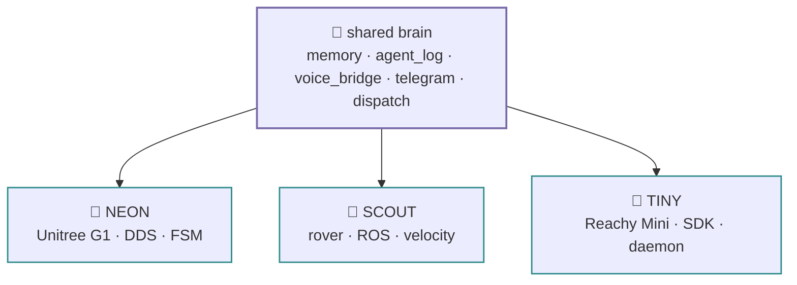

# the family

⏱ 45s

TINY is one of three robots built on the **same shared brain, different body**.
If you know one, you know all three — the cross-persona nervous system (memory
+ agent_log + voice_bridge) is copied verbatim between them. Only the robot
tool layer changes.

| robot | body | control layer | mirrors |
|---|---|---|---|
| **NEON** | Unitree G1 humanoid | DDS / FSM-gated arms + legs | `g1.py`, `tools/g1_*` |
| **SCOUT** | rover | ROS / velocity | `agent.py`, `tools/` |
| **TINY** | Reachy Mini | Reachy SDK → daemon `:8000` | `tiny.py`, `tools/reachy_*` |

## what's identical

- **4 personas** — shell · voice · telegram · thinker
- **shared SQLite brain** — `.memory/mem.db`, unified reasoning log, voice bridge
- **deploy shape** — docker-compose stack + systemd units, boots on power-on
- **single source of truth** — one agent factory, one tool list

## what's different

Only the hardware layer:

- **NEON** gates walking/arms behind an FSM + a single-writer arm mutex; has DDS,
  CycloneDDS, librealsense in a heavy image.
- **SCOUT** issues ROS velocity commands to a mobile base.
- **TINY** talks plain HTTP/WS to the Reachy daemon; no FSM, no danger class,
  a light image. Personality lives in head + antennas + emotion library.

## links

- [neon-the-g1](https://github.com/cagataycali/neon-the-g1)
- [scout-the-rover](https://github.com/cagataycali/scout-the-rover)
- [tiny-the-reachy](https://github.com/cagataycali/tiny-the-reachy)
