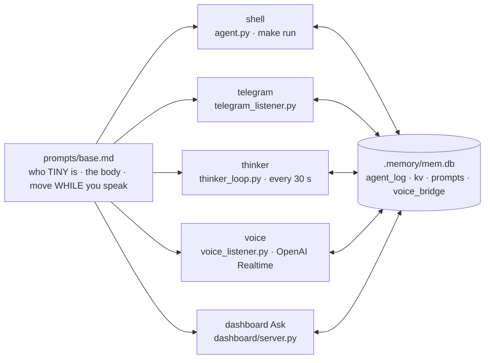

# Personas — five faces, one brain

!!! abstract "In 10 seconds"
    - `tiny.py` builds one Strands `Agent` five ways: same `prompts/base.md`, same tools, same `.memory/mem.db`.
    - Different per face: the **mode block**, the **channel**, and a slim tool list for voice + dashboard Ask (24 of 30).
    - Every prompt ends with the other personas' last 25 `agent_log` rows — how voice knows what Telegram did.



## The five

| persona | starts | tools | answers | model |
|---|---|---|---|---|
| **shell** | `make run` | 30 | plain text | `TINY_MODEL_ID` (Bedrock) |
| **telegram** | `tiny-telegram.service`, one agent per message | 30 | must end with `telegram(action='send_message', …)` | same |
| **thinker** | `tiny-thinker.service`, every `THINKER_INTERVAL` (30 s) | 30 | Telegram photo + caption, `memory(log_add)` | same |
| **voice** | `tiny-voice.service`, one Realtime session, always on | 24 | the speaker, while moving | `VOICE_PROVIDER=openai` · `gpt-realtime-2` · `shimmer` |
| **dashboard** | cockpit `Ask` or `POST /api/chat` | 24 | `/ws` → the *mind* feed | `TINY_MODEL_ID` |

## What every prompt contains

1. `prompts/base.md` — *"TINY. Pronouns: it/robot. Not a chatbot."*, the body in numbers, and the golden rule: gestures happen **while** you speak.
2. The mode block below.
3. A personality note (`prompts(action='set')`) — appended, never substituted.
4. `## 🤖 TINY LIVE STATE` — pose, antennas, IMU, every turn.
5. The other personas' recent `agent_log` rows.

=== "voice"

    *"This IS the robot talking. The words you produce come out of TINY's speaker … You are not describing a robot — you are it."*
    Short, no markdown, no emojis; answer first, then one gesture. **"Silent" = `reachy_volume(0)`, one line, keep listening.** Playbook: greeting → `reachy_express('happy')`, yes → pitch 15 then −10, voice off to a side → `reachy_body_turn(±30)`.

=== "telegram"

    Last 20 messages of that chat, ≤ 8 lines. `/mute` `/unmute` flip `voice.muted`. *"Show the person you're alive"* — it drives the robot too.

=== "thinker"

    *"You run silently in the background, but you are NOT passive … You are TINY's heartbeat."*
    Each cycle: `reachy_camera` → **one** gesture, never last cycle's → `telegram(send_photo)` → `memory(log_add)`.

    !!! warning "Stop it during demos"
        Its gesture lands on top of yours. Cockpit demo mode (`D`) stops exactly this unit.

=== "shell / dashboard"

    Shell: *"running interactively at the shell … reply with plain text."* Dashboard Ask uses the voice tool list, so a typed turn behaves like speech; its tool calls stream into the *mind* overlay live.

## Emotion names

Prompts say `'happy'`; the library's 81 moves carry take numbers (`cheerful1`). Until 2026-09-17 that cost a failed call on most gestures — 125 `emotion 'happy' not found` rows. `resolve_emotion()` (alias → `name+"1"` → unique prefix) fixed every surface; pinned by `tests/test_emotion_resolve.py` — [Expression](expression.md).

```bash
make log-show          # last 30 cross-persona turns
make run | tg | thinker | voice | mute | unmute
```
