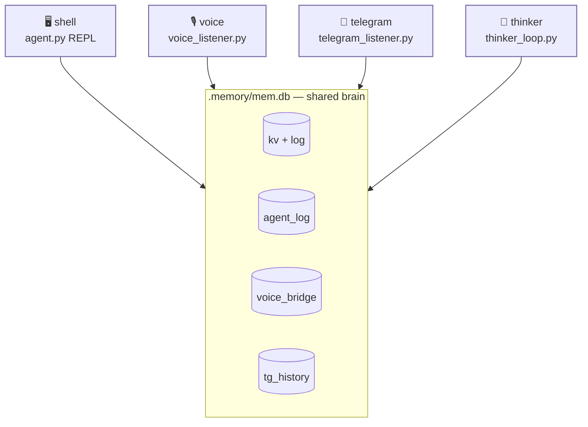

# four personas, one brain

<span class="read-badge">⏱ 60s</span>

TINY is **one** agent with **four** faces. Every persona is built by the same
factory in `tiny.py` and shares the same toolset and the same SQLite brain at
`.memory/mem.db`. When one persona does something, the others *see it*.



## the four

| persona | entry | what it is |
|---|---|---|
| **shell** | `agent.py` | you, interactively, in a REPL |
| **voice** | `voice_listener.py` | always-on bidirectional voice (local mic → speaker) |
| **telegram** | `telegram_listener.py` | incoming DM → spawns a telegram-persona agent |
| **thinker** | `thinker_loop.py` | 30s expressive heartbeat — photo + one expression + journal |

## how they share awareness

Every persona injects a **Unified Reasoning Log** block into its prompt (via
`agent_log.format_for_prompt`). So the voice persona knows what telegram just
did, and the thinker knows what you said in the REPL.

Inbound async messages flow through the **voice bridge**:

```
telegram DM → voice_bridge.push() → voice persona hears a [BRIEFING] → speaks it
```

This is the exact same nervous system as [neon](../reference/family.md) — copied
verbatim. Only the robot tool layer differs.

## run them

```bash
make run       # shell (REPL)
make voice     # bidirectional voice
make tg        # telegram bot
make thinker   # 30s heartbeat loop
make log-show  # last 30 cross-persona turns
```

Or all three background personas at once via [docker](../start/docker.md).
