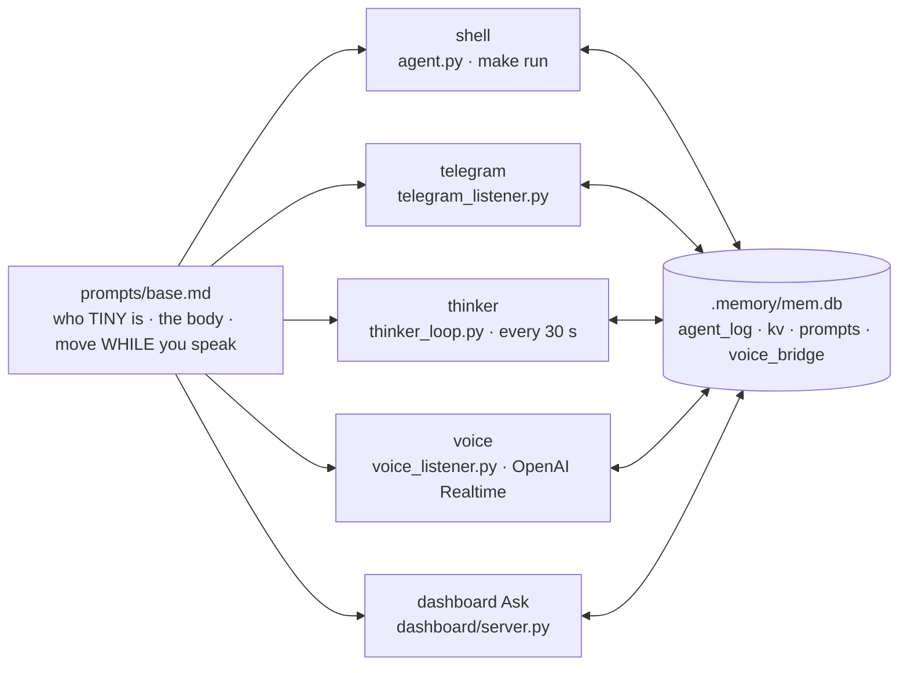

# Personas — five faces, one brain

!!! abstract "In 10 seconds"
    - `tiny.py` builds one `Agent` five ways: same `prompts/base.md`, tools, brain.
    - Per face: the **mode block**, the **channel**, a slim tool list (24 of 30) for voice + Ask.
    - Every prompt ends with the others' last 25 `agent_log` rows — voice knows what Telegram did.



## The five

| persona | starts | tools | answers | model |
|---|---|---|---|---|
| **shell** | `make run` | 30 | plain text | `TINY_MODEL_ID` |
| **telegram** | `tiny-telegram.service`, per message | 30 | `telegram(send_message)` | same |
| **thinker** | `tiny-thinker.service`, every 30 s | 30 | Telegram photo + caption | same |
| **voice** | `tiny-voice.service`, one Realtime session | 24 | the speaker | `gpt-realtime-2` · `shimmer` |
| **dashboard** | `Ask` / `POST /api/chat` | 24 | `/ws` → the *mind* feed | same |

## What every prompt contains

1. `prompts/base.md` — *"TINY. Pronouns: it/robot. Not a chatbot."* and the rule: gestures **while** you speak.
2. The mode block below.
3. A personality note (`prompts(action='set')`) — appended, never substituting.
4. `## 🤖 TINY LIVE STATE` — pose, antennas, IMU.
5. The others' recent `agent_log` rows.

=== "voice"

    *"This IS the robot talking … You are not describing a robot — you are it."*
    Short, no markdown, no emojis; answer, then one gesture. **"Silent" = `reachy_volume(0)`, still listening.**

=== "telegram"

    Last 20 messages, ≤ 8 lines. `/mute` `/unmute` flip `voice.muted`. *"Show the person you're alive."*

=== "thinker"

    *"You run silently in the background, but you are NOT passive … You are TINY's heartbeat."*
    Each cycle: `reachy_camera` → **one** gesture, never the last → `telegram(send_photo)` → `memory(log_add)`.

    !!! warning "Stop it during demos"
        Its gesture lands on top of yours — demo mode (`D`) stops this unit.

=== "shell / dashboard"

    Shell: *"reply with plain text."* Ask uses the voice tool list — a typed turn behaves like speech, streamed into the *mind* overlay.

## Emotion names

Prompts say `'happy'`; the 81 moves carry take numbers (`cheerful1`). Until 2026-09-17 that failed most gestures — 125 `emotion 'happy' not found` rows. `resolve_emotion()` (alias → `name+"1"` → prefix) fixed every surface.

```bash
make log-show          # last 30 cross-persona turns
make run | tg | thinker | voice | mute | unmute
```
