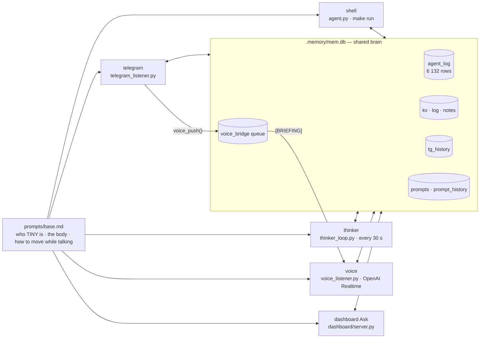

# Personas — five faces, one brain

<span class="read-badge">⏱ 5 min · read from tiny.py on 2026-09-17</span>

TINY is **one** agent factory (`tiny.py`) that builds a Strands `Agent` five different ways. Every build
gets the same body prompt (`prompts/base.md`, 82 lines), the same tool modules and the same SQLite brain at
`.memory/mem.db`. What differs is the **mode block** appended to the prompt, the **channel** the answer
leaves by, and — for the two latency-critical ones — a slimmer tool list.



## The five

| persona | how it starts | tools | answers via | model |
|---|---|---|---|---|
| **shell** | `make run` → `agent.py` REPL on any machine that can reach the daemon | 31 (`build_tools`) | plain text in the terminal | `TINY_MODEL_ID` (Bedrock, default `global.anthropic.claude-opus-4-8`) |
| **telegram** | `tiny-telegram.service`; one agent **per message**, prompt carries the last 20 turns of that chat | 31 | *must* end with `telegram(action='send_message', …)` | same |
| **thinker** | `tiny-thinker.service`; a cycle every `THINKER_INTERVAL` (30 s), fresh prompt + cleared messages each cycle | 31 | Telegram photo + caption to the owner, `memory(log_add, tag='thinker')` | same |
| **voice** | `tiny-voice.service`; one **bidirectional** Realtime session, always on | 24 (`build_voice_tools`) | the speaker, while moving | `VOICE_PROVIDER=openai` · `VOICE_MODEL=gpt-realtime-2` · `VOICE_NAME=shimmer` (also `nova_sonic`, `gemini`) |
| **dashboard** | `Ask` in the cockpit or `POST /api/chat`; one turn at a time (`ask_busy`) | 24 (same slim list, `persona="dashboard"`) | streamed over the WebSocket into the *mind* feed | `TINY_MODEL_ID` |

Tool counts are what `len(tiny.build_tools())` / `len(tiny.build_voice_tools())` return on the robot today
with the fleet bridge off; `TINY_MCP=1` adds up to 8 [fleet tools](../MCP.md) for the personas listed in
`TINY_MCP_PERSONAS`, and never for a turn that *arrived* from another device (depth cap).

## What every prompt contains

Reading `tiny.py`, a persona prompt is always assembled in this order:

1. **`prompts/base.md`** — identity ("TINY. Pronouns: it/robot. Not a chatbot."), the body in numbers
   (head pitch/roll ±40°, yaw ±180°, head–body delta ≤ 65°; body ±160°; antennas in degrees; 4 mics;
   5 W speaker; IMU on the Wireless), and the rule that gestures happen *simultaneously* with speech.
2. **The mode block** for the persona (below).
3. **A personality note**, if the owner set one with `prompts(action='set', persona=…)`. It is appended,
   never substituted — an override cannot remove the body or the tools (`_resolve_body`).
4. **Live state** — `## 🤖 TINY LIVE STATE @ hh:mm:ss`: head pose, antennas, IMU present or not, refreshed
   every turn so the model does not have to call `reachy_get_state` to know where its head is.
5. **The unified reasoning log** — the last 25 (thinker: 30) `agent_log` rows written by the *other*
   personas. This is how the voice knows what Telegram just did, and why the thinker does not repeat the
   gesture the voice made ten seconds ago.

=== "voice"

    *"This IS the robot talking. The words you produce come out of TINY's speaker; what you hear comes
    from TINY's four microphones … You are not describing a robot — you are it."*

    The block lists what is real in *this* session — move & express, `take_photo`, `head_tracking`,
    `turn_to_sound`, `reachy_volume` (**"silent" → volume 0 first, then one short line; TINY keeps
    listening at 0**), memory, `dispatch` for background work, Spotify when mounted, and a fleet line
    that says honestly whether `use_device` is mounted. Voice rules: short, no markdown, no lists, no
    emojis, answer first then one gesture, react to being picked up (IMU). Ends with an **expression
    playbook** — greeting → `reachy_express('happy')`, yes → pitch 15 then −10, someone off to a side →
    `reachy_body_turn(±30)`.

=== "telegram"

    Chat id, username and the last 20 messages of *that* chat. Concise (≤ 8 lines). Knows it is the
    voice persona's sibling: `/mute` and `/unmute` flip the `voice.muted` kv; `voice_say(text, importance)`
    puts words in TINY's mouth. Encouraged to drive the robot too — "show the person you're alive".
    Photos sent to the bot are downloaded and pushed to the voice persona as a `[BRIEFING]`.

=== "thinker"

    *"You run silently in the background, but you are NOT passive … You are TINY's heartbeat."*
    Every cycle, mandatory: (1) `reachy_camera(save_path='/tmp/tiny_view.jpg')`, (2) **one** expressive
    action — rotate, never repeat last cycle, (3) `telegram(send_photo, caption=<one sentence>)` to the
    owner, (4) `memory(log_add, tag='thinker')`. `voice_say` at most once per 5 minutes. The cycle body
    is `thinker_loop.cycle()`: clear messages, rebuild the prompt, one user turn, log the result.

    !!! warning "Stop it during demos"
        The thinker's gesture lands on top of whatever you are doing by hand — and its Telegram photo
        banners hijack taps on a phone. The cockpit's **demo mode** (`D`) stops exactly this unit.

=== "shell / dashboard"

    Shell: *"running interactively at the shell on the robot's companion machine, reply with plain
    text."* Dashboard Ask uses the **voice** tool list under `persona="dashboard"` so that a turn typed
    into the cockpit behaves like something said to the robot; its tool calls and reasoning are recorded
    to `agent_log` with `persona=dashboard` and stream into the *mind* overlay as they happen.

## Emotion names — what the prompts say vs what the library has

The prompts speak plain English (`reachy_express('happy')`, `'curious'`, `'no'`). The HF library
[`pollen-robotics/reachy-mini-emotions-library`](https://huggingface.co/datasets/pollen-robotics/reachy-mini-emotions-library)
has **81 moves and every one carries a take number** — `cheerful1`, `curious1`, `no1`, `surprised2`, `dance3`.
Until 2026-09-17 that mismatch cost a failed tool call and a retry on most gestures: the agent log on the
robot held **125** `emotion 'happy' not found` errors, the newest from the thinker at 05:39 that morning.

`tools/reachy_expression.resolve_emotion()` now maps plain names → real moves (alias table, then
`name+"1"`, then a unique prefix), and the dashboard's `/api/control/express` accepts the same names.
Proven through the tunnel right after deploy:

```json
POST /api/control/express {"name":"happy"}    → {"ok":true,"name":"cheerful1","move":{"uuid":"0362a8d3-…"}}
POST /api/control/express {"name":"teleport"} → 400 {"error":"unknown emotion 'teleport'"}
```

`tests/test_emotion_resolve.py` pins the 81-name catalogue and asserts every alias target exists.
The full list, with families and what each looks like, is on [Expression](expression.md).

## Seeing them share

```bash
make log-show                          # last 30 cross-persona turns from agent_log
ssh reachy 'sqlite3 tiny-the-reachy/.memory/mem.db \
  "select persona,count(*) from agent_log group by persona"'
# 2026-09-17 06:40 BST → dashboard 361 · telegram 16 · thinker 4894 · voice 861
```

Or open the cockpit's **mind** sheet: the same rows, live, with persona chips and paired tool receipts.

## Running them anywhere else

```bash
make run        # shell (REPL)          make voice    # bidirectional voice
make tg         # telegram bot          make thinker  # 30 s heartbeat
make mute / make unmute                 # flip voice.muted without touching the robot
```

The robot runs the four background ones as [systemd units](../start/systemd.md).
