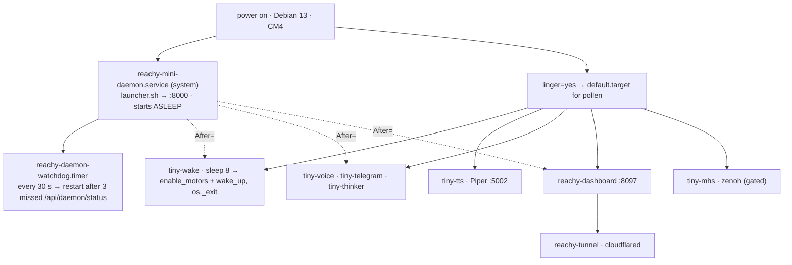

# Systemd — how TINY boots

!!! abstract "In 10 seconds"
    - Pollen's `reachy-mini-daemon` (`:8000`) owns the hardware and boots **asleep**; `tiny-wake` energises the motors 8 s later.
    - Eight user units survive reboots via linger: wake · tts · voice · telegram · thinker · dashboard · tunnel · mhs.
    - `restart`, never `stop` — a stopped unit does not come back.



## The units, as installed (2026-09-17)

| unit | scope | why it exists |
|---|---|---|
| `reachy-mini-daemon` | system | Pollen's daemon — motors, camera, audio. Drop-in `LimitNOFILE=65536` (it hit 1024) |
| `reachy-daemon-watchdog.timer` | system | every 30 s; restarts the daemon after three failed `GET /api/daemon/status` |
| `tiny-wake` | user, oneshot | energises the motors once, **hard-exits** so no SDK socket lingers. **Boot volume floor**: a robot unplugged while silent boots deaf — anything under `REACHY_BOOT_VOLUME_MIN` (60) is raised |
| `tiny-tts` | user | offline Piper (~2.6 s/sentence) for the text personas and **Say** |
| `tiny-voice` · `tiny-telegram` · `tiny-thinker` | user | the personas, `Restart=on-failure`; demo mode stops exactly `tiny-thinker` |
| `reachy-dashboard` | user | the cockpit: `Restart=always`, `TimeoutStopSec=8`; env = `.env` + `~/.reachy-dashboard.env` |
| `reachy-tunnel` | user | Cloudflare tunnel → `:8097`, everything else `404` |
| `tiny-mhs` | user, gated | zenoh mount; `broker-gate.conf` runs `nc -z` first — *activating* off-site, by design |

Voice, telegram, thinker, dashboard carry a `tiny-mcp.conf` drop-in — the [fleet token](../MCP.md).

!!! warning "Lessons the units encode"
    - **`After=` is not enough.** The daemon answers HTTP seconds before the motors are ready — sleep 8 + 20 retries.
    - **Never `stop reachy-dashboard` — `restart`.** uvicorn waited ~90 s on open MJPEG clients before `timeout_graceful_shutdown=2`.
    - **Every persona restart used to kill the camera.** A `no_media` client releases the daemon's media; the dashboard re-acquires within a second.
    - **A dead SDK client stays dead.** After a daemon restart every persona said *"Lost connection"* for 12 minutes — until `get_mini()` learned to rebuild a client whose `_is_alive` is false.

## Day-to-day

```bash
ssh reachy                                      # pollen@reachy-mini.local
systemctl --user list-units 'tiny-*' 'reachy-*'
systemctl --user restart tiny-voice             # after .env or a prompt
systemctl --user restart reachy-dashboard       # after dashboard/*.py (frontend: no restart)
journalctl _SYSTEMD_USER_UNIT=tiny-thinker.service -f   # journalctl --user finds no files here
curl -s localhost:8097/api/health | jq .pressure
sudo systemctl restart reachy-mini-daemon       # last resort; personas reconnect
```

## The repo way

```bash
make venv                     # .venv + requirements
make install-bare-services    # scripts/systemd/tiny-{voice,telegram,thinker}.service → ~/.config/systemd/user, enable-linger, enable --now
make service-status
```

!!! tip "Linger"
    `loginctl show-user $USER -p Linger` must say `yes`, or the units stop with the last SSH session — "the robot forgot everything overnight".
