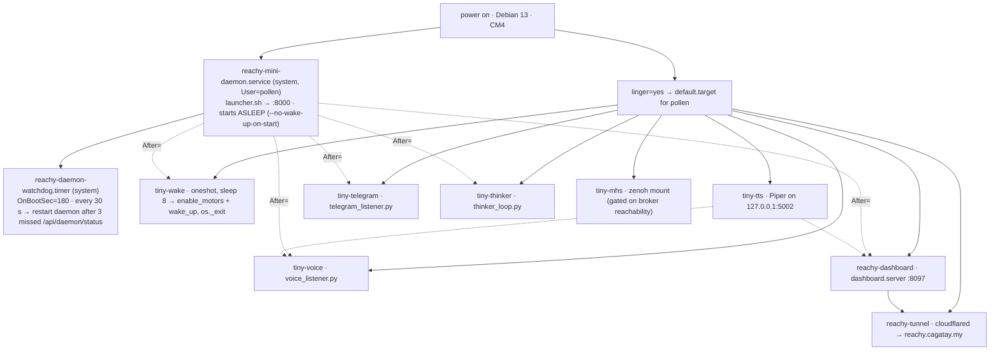

# Systemd — how TINY boots

<span class="read-badge">⏱ 4 min · what actually runs on the CM4</span>

TINY is not one process. On the robot it is **one system unit** (Pollen's daemon), **one system timer**
(the daemon watchdog) and **eight user units** that survive reboots because `pollen` has linger enabled.
This page is the inventory as it stands on the robot on 2026-09-17 (`systemctl --user list-units` over
`ssh reachy`) — the [Makefile](#the-repo-way) installs the three-persona subset on any machine.

## The boot chain



## The units, as installed

| unit | scope | state | ExecStart | why it exists |
|---|---|---|---|---|
| `reachy-mini-daemon` | system | active, enabled | `…/reachy_mini/daemon/app/services/wireless/launcher.sh` | Pollen's daemon — owns motors, camera, mics, speaker; REST + WS on `:8000`. Drop-in `nofile.conf` raises `LimitNOFILE` to **65536** (it hit the 1024 default on 2026-09-17, see [Perception → pressure](../PERCEPTION.md)). |
| `reachy-daemon-watchdog.timer` | system | active | `/usr/local/bin/reachy-daemon-watchdog` every 30 s, first run 180 s after boot | Restarts the daemon after three consecutive failed `GET /api/daemon/status`. |
| `tiny-wake` | user | oneshot, `RemainAfterExit` | `python ~/tiny-wake.py` after `sleep 8` | The daemon boots with motors off; this energises them once and **hard-exits** so no SDK client socket lingers. |
| `tiny-tts` | user | active | `~/tts-venv/bin/python ~/tiny-tts/tiny_tts_server.py` | Offline Piper TTS (`en_US-lessac-medium`, ~2.6 s per sentence) — what the text personas and the dashboard **Say** use. Own venv because `/venvs/apps_venv` is Pollen's. |
| `tiny-voice` | user | active | `/venvs/apps_venv/bin/python voice_listener.py` | Voice persona — OpenAI Realtime, `Restart=on-failure`, `RestartSec=8`. |
| `tiny-telegram` | user | active | `… telegram_listener.py` | Telegram persona. |
| `tiny-thinker` | user | active | `… thinker_loop.py` | 30 s heartbeat persona. The dashboard's **demo mode** stops/starts exactly this unit. |
| `reachy-dashboard` | user | active | `/venvs/apps_venv/bin/python -m dashboard.server` | The cockpit on `:8097`. `Restart=always`, `Nice=5`, `TimeoutStopSec=8`, `KillMode=mixed`. Env: repo `.env` **plus** `~/.reachy-dashboard.env` (token, passkey RP id, origin). |
| `reachy-tunnel` | user | active | `cloudflared tunnel --config ~/.cloudflared/config.yml run reachy` | Named Cloudflare tunnel; ingress `reachy.cagatay.my → http://127.0.0.1:8097`, everything else `404`. `Restart=always`. |
| `tiny-mhs` | user | gated | `python -m demo.mounts.tiny_mount --broker zenoh://…:7447` | Zenoh mount for the MHS demo. Drop-in `broker-gate.conf` runs `nc -z` first and refuses to start when the broker is unreachable — expected to sit in *activating (auto-restart)* off-site. |

Four of them (`tiny-voice`, `tiny-telegram`, `tiny-thinker`, `reachy-dashboard`) carry a `tiny-mcp.conf`
drop-in — `EnvironmentFile=-%h/.tiny-mcp.env` — that gives the persona a tiny.technology token for
[`use_device`](../MCP.md). Remove the file and the persona starts without fleet tools; nothing else changes.

!!! warning "Lessons the units encode"
    - **`After=reachy-mini-daemon.service` is not enough.** The daemon answers HTTP a few seconds before
      the motors are ready; `tiny-wake` sleeps 8 s and retries 20 times for that reason.
    - **Never `systemctl stop reachy-dashboard` during a demo — `restart` it.** uvicorn waits on open MJPEG
      clients; before `timeout_graceful_shutdown=2` + `TimeoutStopSec=8` a stop took ~90 s and left the
      cockpit dark. A `stop` job never auto-restarts; a `restart` does.
    - **Every persona restart used to kill the camera.** Any `ReachyMini(media_backend="no_media")` client
      releases the daemon's media; the dashboard now re-acquires it (`POST /api/media/acquire`) within a
      second — see [Perception](../PERCEPTION.md).
    - **A dead SDK client stays dead.** After a daemon restart every persona said *"Lost connection with
      the server"* for 12 minutes until `tools/_reachy_common.get_mini()` learned to rebuild a client whose
      `_is_alive` is false.

## Day-to-day commands

```bash
ssh reachy                                      # pollen@reachy-mini.local, key auth
systemctl --user list-units 'tiny-*' 'reachy-*' # the eight, with state
systemctl --user restart tiny-voice             # after editing .env or a prompt
systemctl --user restart reachy-dashboard       # after dashboard/*.py changes (frontend: no restart)
journalctl _SYSTEMD_USER_UNIT=tiny-thinker.service -f   # a persona's log (journalctl --user finds no files here)
curl -s localhost:8000/api/daemon/status        # the daemon, unauthenticated, loopback only
curl -s localhost:8097/api/health | jq .pressure # fds / CLOSE-WAIT on the daemon, from the dashboard
sudo systemctl restart reachy-mini-daemon       # last resort; personas reconnect on their own
```

!!! note "Two things that are NOT units"
    The daemon's own `reachy-mini-bluetooth.service` (Pollen's GATT provisioning) is untouched by us.
    And there is **no Docker** on the CM4 — `docker-compose.yml` in the repo is for a laptop next to a
    Reachy Mini Lite (see [Docker](docker.md)). Disk on the CM4 is at 89 % — do not create new venvs there.

## The repo way

On a fresh machine the Makefile installs the persona subset (the dashboard, tunnel and TTS are set up
by hand — [Deploying to the robot](robot.md)):

```bash
make venv                     # .venv + requirements (+ requirements-robot.txt, best effort)
make install-bare-services    # copies scripts/systemd/tiny-{voice,telegram,thinker}.service
                              # → ~/.config/systemd/user, enable-linger, enable --now
make service-status           # systemctl --user status tiny-*.service
```

The unit files in `scripts/systemd/` point at `.venv`; the copies in `scripts/systemd/robot/` are the
CM4 variants that use `/venvs/apps_venv` and `/home/pollen/tiny-the-reachy`. `make install-compose-service`
is the Docker alternative for a laptop.

!!! tip "Linger"
    Both install targets run `loginctl enable-linger $USER`. Verify with
    `loginctl show-user $USER -p Linger` → `Linger=yes`. Without it the user units stop when the last
    SSH session ends — which looks exactly like "the robot forgot everything overnight".
